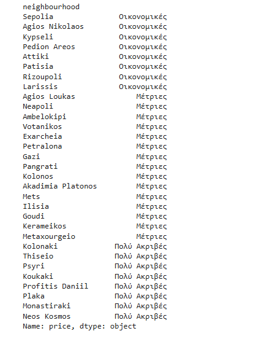

# Data Mining Project

## Table of Contents

1. [Preprocessing](#preprocessing)
   - [Import Prerequisites](#import-prerequisites)
   - [Load Files](#load-files)
   - [Merge Datasets per Year](#merge-datasets-per-year)
   - [2019 Post Processing](#2019-post-processing)
   - [2023 Post Processing](#2023-post-processing)
2. [Null Values](#null-values)
   - [Null Values in 2019](#null-values-in-2019)
   - [Null Values in 2023](#null-values-in-2023)
3. [Clean up](#clean-up)
   - [Cleanup 2019](#cleanup-2019)
   - [Cleanup 2023](#cleanup-2023)
4. [Price to Float](#price-to-float)
5. [Part 1 - Problems](#part-1-problems)
   - [1.1 Most Frequent Room Type](#11-most-frequent-room-type)
   - [1.3 Top 5 Neighbourhoods with Most Reviews](#13-top-5-neighbourhoods-with-most-reviews)
   - [1.4 Neighbourhood with Most Entries](#14-neighbourhood-with-most-entries)
   - [1.5 Entities per Month and per Neighbourhood](#15-entities-per-month-and-per-neighbourhood)
   - [1.6 Histogram of Neighbourhood](#16-histogram-of-neighbourhood)
   - [1.7 Most Frequent Room Type per Neighbourhood](#17-most-frequent-room-type-per-neighbourhood)
   - [1.8 Most Expensive Room Type](#18-most-expensive-room-type)
   - [1.9 Map with Mean Coordinates](#19-map-with-mean-coordinates)
   - [1.10 Wordcloud for Neighbourhood, Transit, Description, Last Review](#110-wordcloud-for-neighbourhood-transit-description-last-review)
   - [1.11 Distribution of Simplified Amenities Categories](#111-distribution-of-simplified-amenities-categories)
   - [1.12 Mean for 2 People Room per Neighbourhood](#112-mean-for-2-people-room-per-neighbourhood)
   - [1.13 Three Additional Questions for Athens](#113-three-additional-questions-for-athens)
   - [1.14 Top 10 Hosts with Most Listings](#114-top-10-hosts-with-most-listings)
   - [1.15 Conclusions](#115-conclusions)
6. [Part 2 - Recommendation System](#part-2-recommendation-system)
   - [TF-IDF Vectorization](#tf-idf-vectorization)
   - [Cosine Similarity](#cosine-similarity)
   - [Recommendation System](#recommendation-system)

## Preprocessing

### Import Prerequisites
In this section, necessary libraries and tools used throughout the notebook are imported. These include popular data manipulation libraries like pandas, data visualization tools such as matplotlib and seaborn, and NLP (natural language processing) tools like `nltk` for text processing. Additionally, stopwords from the `nltk` library are downloaded to assist in the text-cleaning process later on.

### Load Files
Here, the datasets from the Airbnb listings in different months of 2019 and 2023 are loaded into memory. The CSV files for the respective years are read and printed to understand the structure (rows and columns) of each dataset.

### Merge Datasets per Year
The individual monthly datasets for each year (2019 and 2023) are merged into single datasets. This allows easier data processing, ensuring that all listings from various months in a year are available in one unified dataset.

```python
april_2019['month']='april'
february_2019['month']='february'
march_2019['month']='march'

columns_to_keep = [
    'id', 'zipcode', 'transit', 'bedrooms', 'beds', 'review_scores_rating',
    'number_of_reviews', 'neighbourhood', 'neighbourhood_cleansed', 'name', 'latitude', 'longitude',
    'last_review', 'instant_bookable', 'host_since', 'host_response_rate',
    'host_identity_verified', 'host_has_profile_pic', 'first_review',
    'description', 'city', 'cancellation_policy', 'bed_type', 'bathrooms',
    'accommodates', 'amenities', 'room_type', 'property_type', 'price',
    'availability_365', 'minimum_nights', 'month', 'host_id'
]

year2019 = pd.concat([april_2019, february_2019, march_2019])

year2019.reset_index(drop=True, inplace=True)

year2019 = year2019[columns_to_keep]

year2019.to_csv('output/train_2019.csv', index=False)
```


### 2019 Post Processing

This segment handles post-processing of the 2019 dataset. It includes steps like handling missing values, feature extraction, and data cleaning to prepare the dataset for further analysis. Each column in the dataset is examined, and irrelevant data is either removed or transformed into a useful format.

```python
april_2019['month']='april'
february_2019['month']='february'
march_2019['month']='march'

columns_to_keep = [
    'id', 'zipcode', 'transit', 'bedrooms', 'beds', 'review_scores_rating',
    'number_of_reviews', 'neighbourhood', 'neighbourhood_cleansed', 'name', 'latitude', 'longitude',
    'last_review', 'instant_bookable', 'host_since', 'host_response_rate',
    'host_identity_verified', 'host_has_profile_pic', 'first_review',
    'description', 'city', 'cancellation_policy', 'bed_type', 'bathrooms',
    'accommodates', 'amenities', 'room_type', 'property_type', 'price',
    'availability_365', 'minimum_nights', 'month', 'host_id'
]

year2019 = pd.concat([april_2019, february_2019, march_2019])

year2019.reset_index(drop=True, inplace=True)

year2019 = year2019[columns_to_keep]

year2019.to_csv('output/train_2019.csv', index=False)
```

### 2023 Post Processing
Similar to the 2019 post-processing step, this section involves cleaning and extracting important features from the 2023 dataset. Data is cleaned by addressing missing values and performing operations such as data normalization or transformation for consistency.

```python
september_2023['month']='september'
march_2023['month']='march'
june_2023['month']='june'

columns_to_keep = [
    'id', 'bedrooms', 'beds', 'review_scores_rating',
    'number_of_reviews', 'neighbourhood', 'neighbourhood_cleansed', 'name', 'latitude', 'longitude',
    'last_review', 'instant_bookable', 'host_since', 'host_response_rate',
    'host_identity_verified', 'host_has_profile_pic', 'first_review',
    'description', 'bathrooms',
    'accommodates', 'amenities', 'room_type', 'property_type', 'price',
    'availability_365', 'minimum_nights', 'month', 'host_id'
]

year2023 = pd.concat([september_2023, march_2023, june_2023])

year2023.reset_index(drop=True, inplace=True)

year2023 = year2023[columns_to_keep]

year2023.to_csv('output/train_2023.csv', index=False)
```

## Null Values

### Null Values in 2019
In this section, the notebook examines the 2019 dataset for missing values. The results help identify which columns have null or missing data, allowing the user to decide how to handle them (e.g., by filling, removing, or ignoring them).

### Null Values in 2023
Similar to the 2019 dataset, the 2023 dataset is examined for null values. The missing data is identified, and this step provides insight into which columns need further attention.

## Clean up

### Cleanup 2019
This step involves the actual cleaning of the 2019 dataset. Missing or erroneous values are handled by either imputing, filling with default values, or removing unnecessary columns. The goal is to create a clean, ready-to-analyze dataset.

```python
year2019_important=['id', 'name', 'latitude', 'longitude', 'host_identity_verified', 'cancellation_policy', 'property_type', 'price' , 'city', 'neighbourhood']

year2019 = year2019.dropna(subset=year2019_important)

null_values = year2019.isnull().sum()

print('Null values in 2019', null_values)
```

### Cleanup 2023
As with 2019, the 2023 dataset undergoes a similar cleaning process to remove or handle missing values, prepare the data, and ensure that all features are in the correct format for further analysis.

```python
year2023_important=['id', 'name', 'latitude', 'longitude', 'host_identity_verified', 'property_type', 'price', 'neighbourhood']

year2023 = year2023.dropna(subset=year2023_important)

null_values = year2023.isnull().sum()

print('Null values in 2023', null_values)
```

## Price to Float
The price column in both datasets (2019 and 2023) is stored as a string with symbols (e.g., dollar signs). In this step, the price is converted into a numeric format, specifically a floating-point number, so that mathematical operations and comparisons can be performed.

## Part 1 - Problems

### 1.1 Most Frequent Room Type
This section identifies the most common or frequent room type in both the 2019 and 2023 datasets. The analysis gives insight into which type of accommodation is most popular.

```python
room_type_counts = year2019['room_type'].value_counts()

plt.figure(figsize=(8, 6))
room_type_counts.plot(kind='bar', color='green')
plt.xlabel('Room Type')
plt.ylabel('Frequency')
plt.title('Frequency of Room Types')
plt.xticks(rotation=45, ha='right')
plt.tight_layout()
plt.show()
```


### 1.2 Price Graph per month
Calculate mean price per month and display results in bar diagram

```python
monthly_prices_2019 = year2019.groupby('month')['price'].mean().reset_index()

plt.figure(figsize=(6, 6))
plt.bar(monthly_prices_2019['month'], monthly_prices_2019['price'], color='skyblue')
plt.xlabel('Month')
plt.ylabel('Average Price')
plt.title('Average Price Variation Over 3 Months')

for i, price in enumerate(monthly_prices_2019['price']):
    plt.text(i, price + 0.5, f'{price:.2f}', ha='center', va='bottom')

plt.ylim(bottom=0)
plt.tight_layout()
plt.show()
```


### 1.3 Top 5 Neighbourhoods with Most Reviews
In this step, the top 5 neighborhoods that received the most reviews are identified. This helps in understanding the most active or popular neighborhoods in terms of user feedback and interaction.

```python
neighborhood_review_counts = year2019.groupby('neighbourhood_cleansed')['number_of_reviews'].sum()

top_5 = neighborhood_review_counts.nlargest(5)

print(top_5)

plt.figure(figsize=(10, 6))
top_5.plot(kind='bar', color='skyblue')
plt.xlabel('Neighborhood')
plt.ylabel('Number of Reviews')
plt.title('Top 5 Neighborhoods with the Most Reviews 2019')
plt.xticks(rotation=45, ha='right')
plt.tight_layout()
plt.show()
```


### 1.4 Neighbourhood with Most Entries
This section finds the neighborhood that has the highest number of listings. It can indicate the area with the most rental activity or popularity.

```python
neighbourhood_2019_count = year2019['neighbourhood_cleansed'].value_counts()

max_neighbourhood_2019 = neighbourhood_2019_count.idxmax()
max_count_2019 = neighbourhood_2019_count.max()

data_2019 = {
    "Neighbourhood": [max_neighbourhood_2019],
    "Entries": [max_count_2019],
    "Year": [2019]
}

df_2019 = pd.DataFrame(data_2019)

print(df_2019)
```


### 1.5 Entities per Month and per Neighbourhood
The data is analyzed to check how many entities (listings) are created or active per month and per neighborhood. This can give an idea of seasonal trends or neighborhood popularity over time.

```python
entries_per_month_and_neighbourhood = year2019.groupby(['month', 'neighbourhood_cleansed']).size().reset_index(name='entries_count')
sorted_entries = entries_per_month_and_neighbourhood.sort_values(by='entries_count', ascending=False)
print(sorted_entries)

plt.figure(figsize=(15, 20))
heatmap_data = sorted_entries.pivot(index="neighbourhood_cleansed",columns="month",values="entries_count")

sns.heatmap(heatmap_data, cmap="Blues", annot=True, fmt="d", linewidths=.5, cbar_kws={'label': 'Entries Count'})

plt.title("Number of Entries per Month and Neighbourhood", fontsize=16)
plt.xlabel("Month", fontsize=14)
plt.ylabel("Neighbourhood", fontsize=14)
plt.xticks(rotation=45, ha='right', fontsize=12)
plt.yticks(fontsize=10)

plt.tight_layout(pad=3)
plt.show()
```


### 1.6 Histogram of Neighbourhood
A histogram is generated to visualize the distribution of listings across different neighborhoods. This visualization helps in understanding how the listings are spread geographically.

```python
neighbourhood_counts = year2019['neighbourhood_cleansed'].value_counts()

plt.figure(figsize=(20, 8))
neighbourhood_counts.plot(kind='bar', color='skyblue')

for i, count in enumerate(neighbourhood_counts):
    plt.text(i, count, str(count), ha='center', va='bottom')

plt.title('Histogram of Neighborhoods - 2019')
plt.xlabel('Neighborhood')
plt.ylabel('Count')
plt.xticks(rotation=90)
plt.tight_layout()
plt.show()
```


### 1.7 Most Frequent Room Type per Neighbourhood
This analysis dives deeper by identifying the most common room type in each neighborhood. It provides a breakdown of the preferred types of accommodations across different areas.

```python
room_type_counts = year2019.groupby(['neighbourhood_cleansed', 'room_type']).size().reset_index(name='count')
plt.figure(figsize=(16, 12))
sns.barplot(data=room_type_counts, x='neighbourhood_cleansed', y='count', hue='room_type')
plt.title('Frequency of Room Types in Each Neighborhood')
plt.xlabel('Neighborhood')
plt.ylabel('Frequency')
plt.xticks(rotation=90, ha='right')
plt.legend(title='Room Type', bbox_to_anchor=(1, 1))
plt.tight_layout()
plt.show()
```


### 1.8 Most Expensive Room Type
This section identifies which room type is the most expensive in terms of listing price. It offers insight into the high-end market and which types of accommodations attract the highest prices.

```python
room_type_prices = year2019.groupby('room_type')['price'].mean().round(2)
max_room_type_price = room_type_prices.idxmax()
highest_mean_price = room_type_prices.max()

room_type_prices_df = room_type_prices.reset_index()
room_type_prices_df.columns = ['Room Type', 'Mean Price']

max_price_room_type_df = room_type_prices_df[room_type_prices_df['Room Type'] == max_room_type_price]

print("Room Type with Maximum Mean Price:")
print(max_price_room_type_df)
```


### 1.9 Map with Mean Coordinates
A map is generated using the mean coordinates of listings in each neighborhood, providing a geographical overview of where listings are concentrated.

```python
month_data = year2023[year2023['month'] == 'march']

map = folium.Map(location=[month_data['latitude'].mean(), month_data['longitude'].mean()], zoom_start=10)

for index, row in month_data.iterrows():
    if 'transit' in row:
        popup_text = f"<b>{row['name']}</b><br>Room Type: {row['room_type']}<br>Transit: {row['transit']}"
    else:
        popup_text = f"<b>{row['name']}</b><br>Room Type: {row['room_type']}"
    folium.Marker(location=[row['latitude'], row['longitude']], popup=popup_text).add_to(map)

map.save('properties_map.html')
```

### 1.10 Wordcloud for Neighbourhood, Transit, Description, Last Review
Wordclouds are generated for textual data in the datasets, such as neighborhood descriptions, transit information, and reviews. This helps visualize the most common words or phrases associated with these categories.

```python
def generate_wordcloud(data, title):
    data = data.split(' ')
    word_freq = Counter(data)
    wordcloud = WordCloud(width=800, height=400, background_color='white').generate_from_frequencies(word_freq)
    plt.figure(figsize=(10, 6))
    plt.imshow(wordcloud, interpolation='bilinear')
    plt.title(title)
    plt.axis('off')
    plt.show()

neighbourhood_text = ' '.join(year2019['neighbourhood_cleansed'].dropna().astype(str))
generate_wordcloud(neighbourhood_text, 'Neighbourhood WordCloud')

transit_text = ' '.join(year2019['transit'].dropna().astype(str))
generate_wordcloud(transit_text, 'Transit WordCloud')

description_text = ' '.join(year2019['description'].dropna().astype(str))
generate_wordcloud(description_text, 'Description WordCloud')

last_review_text = ' '.join(pd.to_datetime(year2019['last_review'].dropna().astype(str)).dt.strftime('%B'))
generate_wordcloud(last_review_text, 'Last Review WordCloud')
```


### 1.11 Distribution of Simplified Amenities Categories
This section looks at the amenities offered by listings, grouping them into simplified categories, and analyzing the distribution. It provides an understanding of which amenities are most frequently offered.

```python
year2019['amenities_category'] = 'Other'

categories = {
    'kitchen': ['Breakfast', 'Cooking basics', 'BBQ', 'grill', 'oven', 'Coffee maker'],
    'accessibility': ['Accessible-height bed', 'Accessible-height toilet', 'Wide doorway', 'Wide hallway clearance'],
    'Electricity_and_Technology': ['EV charger', 'Ethernet connection', 'Game console', 'Projector and screen'],
    'facilities': ['Private entrance', 'Private living room', 'Lock on bedroom door', 'Outlet covers', 'Window guards'],
    'kids_friendly': ['Baby bath', 'Baby monitor', 'Changing table', 'Children’s books and toys', 'High chair'],
    'security': ['Security cameras', 'Fire extinguisher', 'First aid kit', 'Safety card', 'Smoke detector'],
    'services': ['Self check-in', 'Luggage dropoff allowed', 'Long term stays allowed', 'Pets allowed']
}

for category, items in categories.items():
    year2019.loc[year2019['amenities'].str.contains('|'.join(items)), 'amenities_category'] = category
print(year2019['amenities_category'].unique())

plt.figure(figsize=(10, 6))
sns.countplot(data=year2019, x='amenities_category', palette='Set2')
plt.title('Distribution of Simplified Amenities Categories')
plt.xlabel('Amenities Category')
plt.ylabel('Count')
plt.xticks(rotation=45)
plt.tight_layout()
plt.show()
```


### 1.12 Mean for 2 People Room per Neighbourhood
Here, the mean price for a two-person room in each neighborhood is calculated and analyzed, giving insight into pricing patterns across areas.

```python
filtered_rooms = year2019[year2019['accommodates'] == 2]

mean_price_per_neighbourhood = filtered_rooms.groupby('neighbourhood')['price'].mean().sort_values()

plt.figure(figsize=(16, 12))
mean_price_per_neighbourhood.plot(kind='barh', color='skyblue')
plt.xlabel('Mean Price')
plt.ylabel('Neighbourhood')
plt.title('Mean Price per Neighbourhood')
plt.show()

q1 = mean_price_per_neighbourhood.quantile(0.25)
q3 = mean_price_per_neighbourhood.quantile(0.75)

def categorize_neighbourhood(price):
    if price < q1:
        return 'Οικονομικές'
    elif price < q3:
        return 'Μέτριες'
    else:
        return 'Πολύ Ακριβές'

neighbourhood_categories = mean_price_per_neighbourhood.apply(categorize_neighbourhood)

print(neighbourhood_categories)
```





### 1.13 Three Additional Questions for Athens
This part of the notebook explores three specific questions about listings in Athens:
1. How does the number of reviews correlate with review scores?
2. Do hosts with verified identities and profile pictures receive better ratings or more bookings?
3. What is the relationship between the instant bookable feature and the review score?

### 1.14 Top 10 Hosts with Most Listings
The top 10 hosts with the most listings are identified. This analysis helps in understanding the most active or influential hosts in the market.

### 1.15 Conclusions
This section summarizes the conclusions drawn from the data mining process, based on the insights generated from the analysis of both 2019 and 2023 datasets.

## Part 2 - Recommendation System

### TF-IDF Vectorization
In this section, the text data (e.g., reviews, descriptions) is processed using TF-IDF vectorization to represent textual information in numerical format. This is essential for further analysis, especially for calculating similarities between texts.

### Cosine Similarity
Once the text data is vectorized, cosine similarity is used to calculate the similarity between different texts. This method helps in finding similar listings based on textual information.

### Recommendation System
Using the vectorized data and similarity measures, a recommendation system is built. The system suggests listings to users based on similarities in features or textual descriptions.
